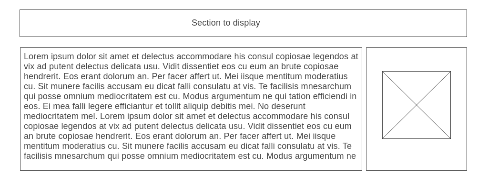
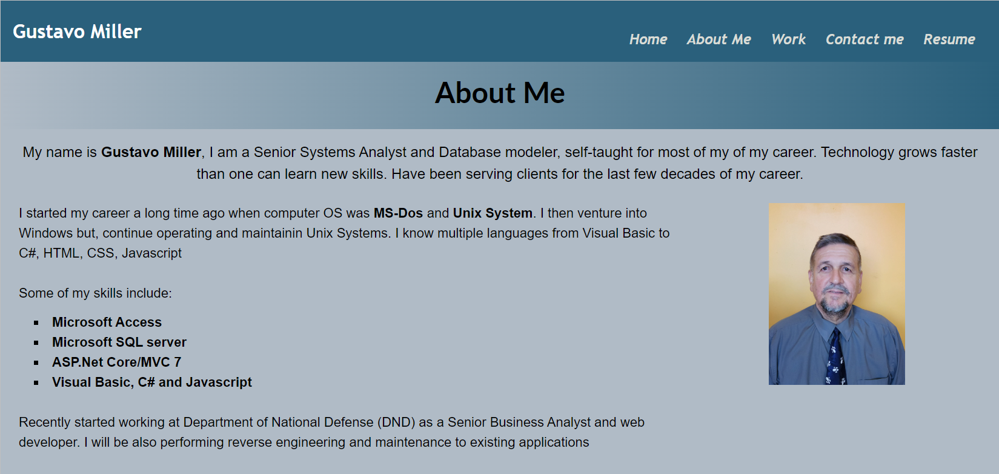
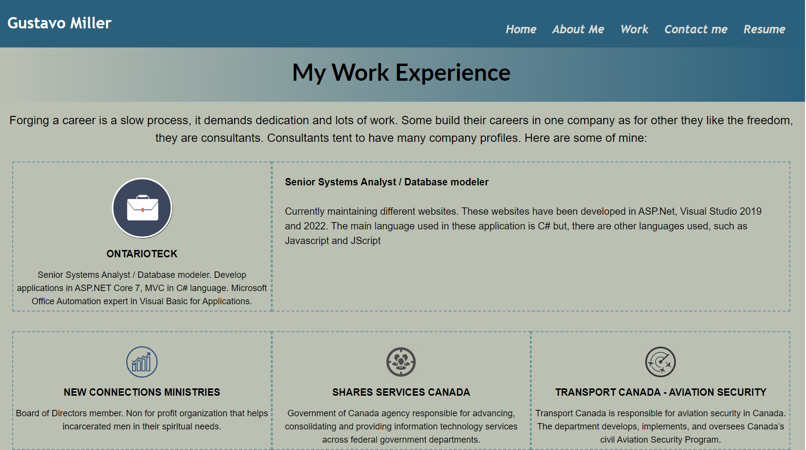
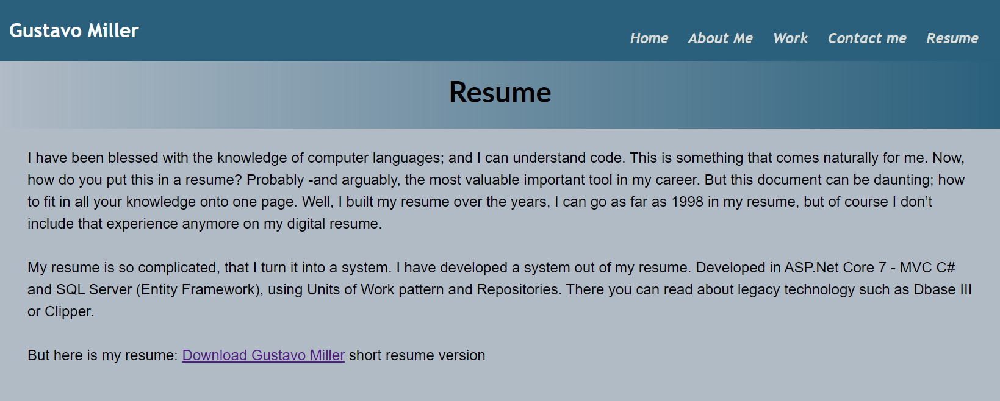
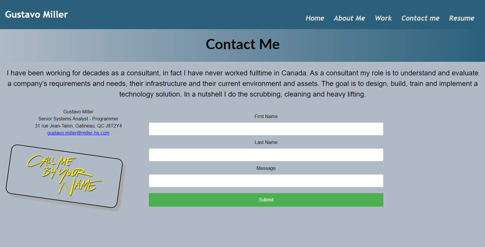

    

    
    
    

 

# Carleton University - Bootcamp

## Module 02 - Personal Profile

An even-numbered week challenge, therefore we need to start a template from scratch! Our task for this week challenge is to build a **Personal Profile Application** in where we present ourselves, as well as our skills in Web Developing, offer a way of contacting us and download of our resume. This profile will be refactored many times until we complete our course, this will hopefully be used to launch our new careers in web-developing

## Understanding requirements
Build a website in where potential employers can have a taste of what we can do, using this **Personal Profile** as a sample of a **Web Application**. The website should offer the most common techniques used in the market. For now, we have been asked to apply what we have learned so far.

The website has been designed in differente sections which are based on a wireframe designed to hold each of these sections. I have used several wireframes in order to keep the flow in the application. For example the about page was based on the following wireframe:

## Hero Website Portal
The portal section shows just a splash screen as form of presentation with a slogan. This portal gives space to the user to select the options from the navigation bar. The navigation bar present with the followin options:

<ul>
<li><strong>Home</strong> - This will return to the hero page ( application portal).</li>
<li><strong>About me</strong> - Presents user with About me information.</li>
<li><strong>Work</strong> - Includes the latest contract a few other ones.</li>
<li><strong>Contact me</strong> - Allows user to create a form to be used to contact me.</li>
<li><strong>Resume</strong> - Allows user to download (pdf) resume.</li>
</ul>

## About Us
In this section I present myself share with the reader information related to my career. What I am capable of doing and some of the tools that I have used in the past.

 
## My Experience Page
This page describes about the contracts and a brief description of what I have done. Sections will highlight when mouse hovers each of them.

## Download My Resume Page
This page is used to download my resume. This is linked to an actual resume I have on the web.

## Contact Me Page

## Updating GitHub Repository
Based on Wikipedia Github is define as "a platform and cloud-based service for software development and version control using Git, allowing developers to store and manage their code." As developers it is important that we keep our versions, in case reversing changes is necessary.

Github, though it is integrated nicely in our gui editors such as `Visual Code` or `Visual Studio suits` , we need to understand Git -a version control system. We have use several commands to register our changes in GitHub:

<ul>
<li><strong>git pull</strong> - Download changes and directly merge/integrate new code</li>
<li><strong>git checkout main</strong> - Checkout the main branch</li>
<li><strong>git add -A [comments]</strong> - Include comments related to changes. Includes all changes</li>
<li><strong>git pull origin main</strong> - Download changes and directly merge/integrate new code</li>
<li><strong>git status</strong> - Displays changed files in your working directory</li>
</ul>

## Delivering Our Assignment
The last -but not the least, task in our assignment was to upload and post our assignment. As developers we will have to implement our systems -websites or other applications, in different environments; **Developing**, **QA Testing** and **Production**. 

It is important that we spend time understanding the procedures and business parameters or rules, when deploying a ready-for-testing-product or production-version.

Author: <strong>Gustavo Miller</strong> 
    <a href="mailto:gustavo.miller@miller-hs.com?subject=Carleton Bootcamp experience">gustavo.miller@miller-hs.com"</a>

